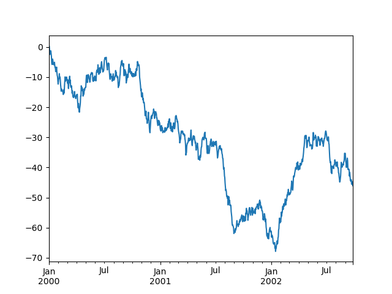

# Categoricals
판다스는 DataFrame에 범주형(Categorical) 데이터를 포함할 수 있다.
```python
df = pd.DataFrame(
    {"id": [1, 2, 3, 4, 5, 6], "raw_grade": ["a", "b", "b", "a", "a", "e"]}
)
```  

raw_grade를 범주형 데이터로 변환한다
```python
df["grade"] = df["raw_grade"].astype("category")

df["grade"]
```
```
0    a
1    b
2    b
3    a
4    a
5    e
Name: grade, dtype: category
Categories (3, object): ['a', 'b', 'e']
```
범주에 좀 더 의미있는 이름을 붙인다.
```python
new_categories = ["very good", "good", "very bad"]

df["grade"] = df["grade"].cat.rename_categories(new_categories)
```
범주를 재정렬함과 동시에 비어있는 범주도 더해준다.
```python
df["grade"] = df["grade"].cat.set_categories(
    ["very bad", "bad", "medium", "good", "very good"]
)

df["grade"]
```
```
0    very good
1         good
2         good
3    very good
4    very good
5     very bad
Name: grade, dtype: category
Categories (5, object): ['very bad', 'bad', 'medium', 'good', 'very good']
```

# Plotting
판다스는 matplotlib API의 표준 문법을 사용한다
```python
import matplotlib.pyplot as plt

plt.close("all")
```
`plt.close`메소드는 figure window를 닫는 데 쓰인다.
```python
ts = pd.Series(np.random.randn(1000), index=pd.date_range("1/1/2000", periods=1000))

ts = ts.cumsum()

ts.plot();
```

`plot()`을 사용하여 모든 열들을 그래프로 보여줄 수 있다.  

Jupyter를 사용할 때는 plot()을 사용하면 되지만, 다른 경우에는 `matplotlib.pyplot.show`를 사용해 보여주거나 `matplotlib.pyplot.savefig`를 사용해 파일에 저장한다.

# 데이터 입출력

## CSV
CSV(Comma-Seperated values)란 `,`을 구분문자로 사용하여 필드를 구분하는 텍스트 데이터다.  

`csv`파일에 저장하기 위해서 `DataFrame.to_csv()`를 사용한다
```python
df = pd.DataFrame(np.random.randint(0, 5, (10, 5)))

df.to_csv("foo.csv")
```
`csv`파일을 불러오기 위해서 `read_csv()`를 사용한다
```python
pd.read_csv("foo.csv")
```
```
   Unnamed: 0  0  1  2  3  4
0           0  4  3  1  1  2
1           1  1  0  2  3  2
2           2  1  4  2  1  2
3           3  0  4  0  2  2
4           4  4  2  2  3  4
5           5  4  0  4  3  1
6           6  2  1  2  0  3
7           7  4  0  4  4  4
8           8  4  4  1  0  1
9           9  0  4  3  0  3
```

## Excel
Excel파일에 대한 입출력은 csv와 비슷하게 `DataFrame.to_excel()` 과 `read_excel()`을 사용하면 된다.
```python
df.to_excel("foo.xlsx", sheet_name="Sheet1")

pd.read_excel("foo.xlsx", "Sheet1", index_col=None, na_values=["NA"])
```
```
   Unnamed: 0  0  1  2  3  4
0           0  4  3  1  1  2
1           1  1  0  2  3  2
2           2  1  4  2  1  2
3           3  0  4  0  2  2
4           4  4  2  2  3  4
5           5  4  0  4  3  1
6           6  2  1  2  0  3
7           7  4  0  4  4  4
8           8  4  4  1  0  1
9           9  0  4  3  0  3
```